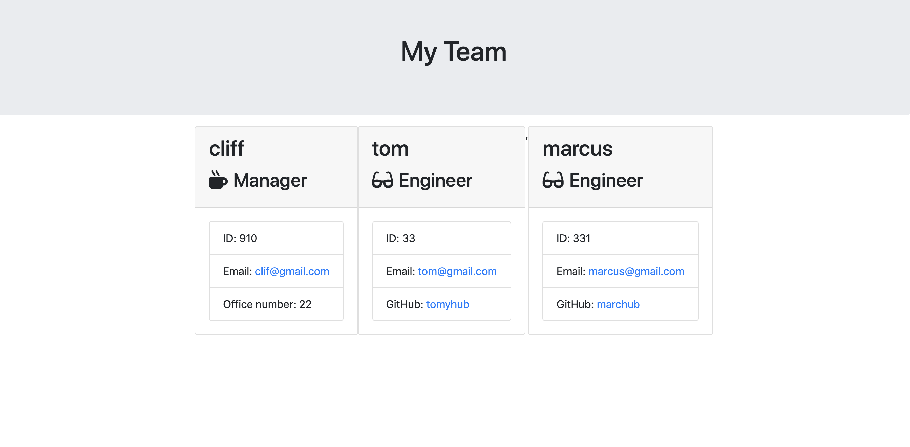

# Team-profile Generator

## Description
The following application is a command-line application that will create a team of employers based off user input.  In order to use the application, a user would have to navigate to where the "app.js" file is located and open up their terminal.  The application can be started by typing the following command in the
terminal and pressing the "enter" key:

```sh
node app.js
```

The user will then be prompted with a series of questions regarding their GitHub username and project.  Once complete, a "readme" file will be generated
with the user's information and responses.

## Technologies
This application uses the following: Node.js, Axios, Dotenv, and Inquirer.

## Experiences
Building this application was a good experience that helped reinforced concepts I had learned previously. One of the challenging parts I had building this application was connecting all of the files so that the main application would work. I learned more about utilizing tests in an application and using tests in test driven development.

## Functionality Demonstration

 

