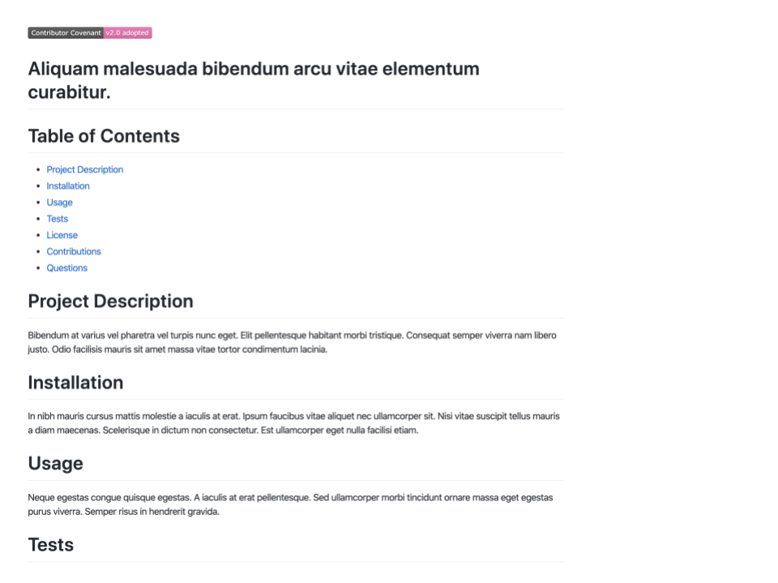

# Good Readme Generator

## Description
The following application is a command-line application that will create a "readme" file based off user input.  In order to use the application, a user
would have to navigate to where the "index.js" file is located and open up their terminal.  The application can be started by typing the following command in the
terminal and pressing the "enter" key:

```sh
node index.js
```

The user will then be prompted with a series of questions regarding their GitHub username and project.  Once complete, a "readme" file will be generated
with the user's information and responses.

## Technologies
This application uses the following: Node.js, Axios, Dotenv, and Inquirer.

## Experiences
Building this application was a challenge.  One of the challenging parts of building the application was being able to use user input in order to make an API
call using Axios.  Another challenge was being able to combine data from two different sources for use in generating the readme file.  Through this experience,
I learned more about using packages from npm, using an async function, and modularizing my application.

## Functionality Demonstration

Click [here](https://drive.google.com/file/d/1gkDK0wx3F0ep0z93pYrUuNgXxVaYC1_j/view) for a video demonstration of the application's functionality.

Readme Output  


